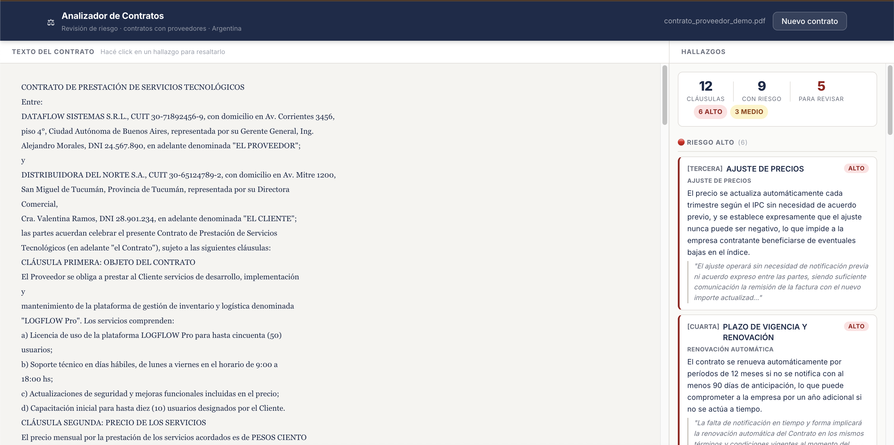

# Analizador de Contratos con IA

Herramienta de asistencia para análisis de contratos con proveedores en Argentina. Sube un PDF y el sistema identifica cláusulas de riesgo, las clasifica por severidad, cita el texto exacto y genera un informe navegable.



> **⚠ Herramienta de asistencia.** No reemplaza la revisión de un profesional del derecho.

---

## Qué hace

1. **Extrae el texto** del PDF con PyMuPDF (fallback a pdfplumber)
2. **Segmenta por cláusula** detectando automáticamente el formato legal del documento (CLÁUSULA PRIMERA, ARTÍCULO 1°, 1.-, numerales romanos, etc.)
3. **Analiza el riesgo** de cada cláusula con Claude (Anthropic), devolviendo tipo de riesgo, nivel (alto/medio/bajo), explicación en español y cita textual
4. **Presenta un dashboard** con el texto resaltado y los hallazgos ordenados por severidad

### Tipos de riesgo detectados

Renovación automática · Ajuste de precios · Exclusividad · Penalidades por incumplimiento · Plazo de preaviso · Limitación de responsabilidad · Confidencialidad y duración · Jurisdicción · Cesión del contrato · Indemnidad

---

## Stack

| Componente | Tecnología |
|------------|------------|
| Pipeline de análisis | Python 3.10+ · stdlib pura |
| Extracción de PDF | PyMuPDF + pdfplumber (fallback) |
| Análisis con IA | Anthropic API · claude-sonnet-4-6 |
| Backend web | FastAPI · Uvicorn |
| Frontend | React 18 · Vite · CSS vanilla |

---

## Estructura del proyecto

```
analizador-contratos/
├── src/
│   ├── extractor.py      # Extracción de texto de PDF
│   ├── segmenter.py      # Segmentación por cláusula
│   ├── analyzer.py       # Análisis de riesgo con Claude
│   ├── api.py            # Backend FastAPI (POST /analizar)
│   └── main.py           # CLI: pipeline completo por consola
├── frontend/
│   └── src/
│       ├── App.jsx                      # Máquina de estados
│       ├── components/ContractViewer    # Panel izquierdo con highlights
│       ├── components/FindingsList      # Panel derecho con hallazgos
│       └── components/UploadZone        # Drag & drop de PDF
├── ejemplos/
│   └── generar_contrato_demo.py   # Genera un contrato de prueba en PDF
├── requirements.txt
├── .env.example
└── CLAUDE.md                      # Alcance y reglas del MVP
```

---

## Instalación y uso

### Requisitos

- Python 3.10+
- Node.js 18+
- API key de Anthropic

### Backend

```bash
python -m venv .venv
source .venv/bin/activate       # Windows: .venv\Scripts\activate
pip install -r requirements.txt

cp .env.example .env
# Editar .env y agregar ANTHROPIC_API_KEY=sk-ant-...

# Arrancar la API
uvicorn src.api:app --reload --port 8000
```

### Frontend

```bash
cd frontend
npm install
npm run dev
# → http://localhost:5173
```

### CLI (sin frontend)

```bash
python src/main.py ruta/al/contrato.pdf
```

### Generar un contrato de demo

```bash
python ejemplos/generar_contrato_demo.py
python src/main.py ejemplos/contrato_proveedor_demo.pdf
```

---

## Variables de entorno

| Variable | Descripción | Default |
|----------|-------------|---------|
| `ANTHROPIC_API_KEY` | API key de Anthropic | — (requerida) |
| `ANALYZER_MODEL` | Modelo de Claude | `claude-sonnet-4-6` |

---

## API

`POST /analizar` — recibe un PDF como `multipart/form-data` y devuelve:

```json
{
  "resumen": { "total_clausulas": 12, "con_riesgo": 9, "por_nivel": {...} },
  "texto_completo": "...",
  "hallazgos": [{
    "numero_clausula": "TERCERA",
    "titulo_clausula": "AJUSTE DE PRECIOS",
    "nivel_riesgo": "alto",
    "tipo_riesgo": "ajuste de precios",
    "explicacion": "...",
    "cita_textual": "...",
    "char_start": 1646,
    "char_end": 2193
  }]
}
```

`char_start` / `char_end` permiten al frontend resaltar exactamente el fragmento de texto en el visor.

`GET /health` — estado del servidor y configuración activa.

---

*Portfolio · MVP con datos de demo · Argentina*
